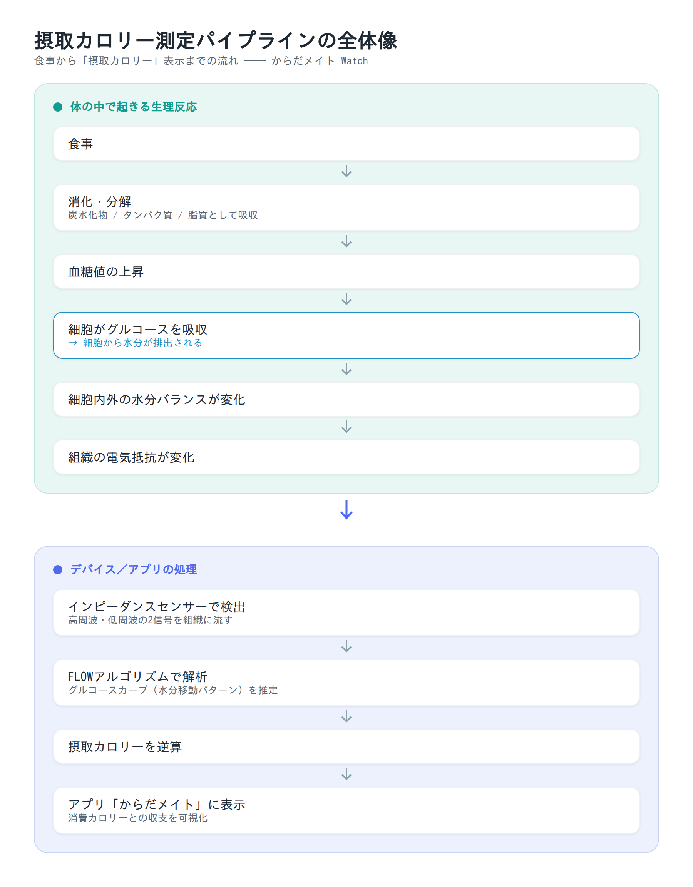
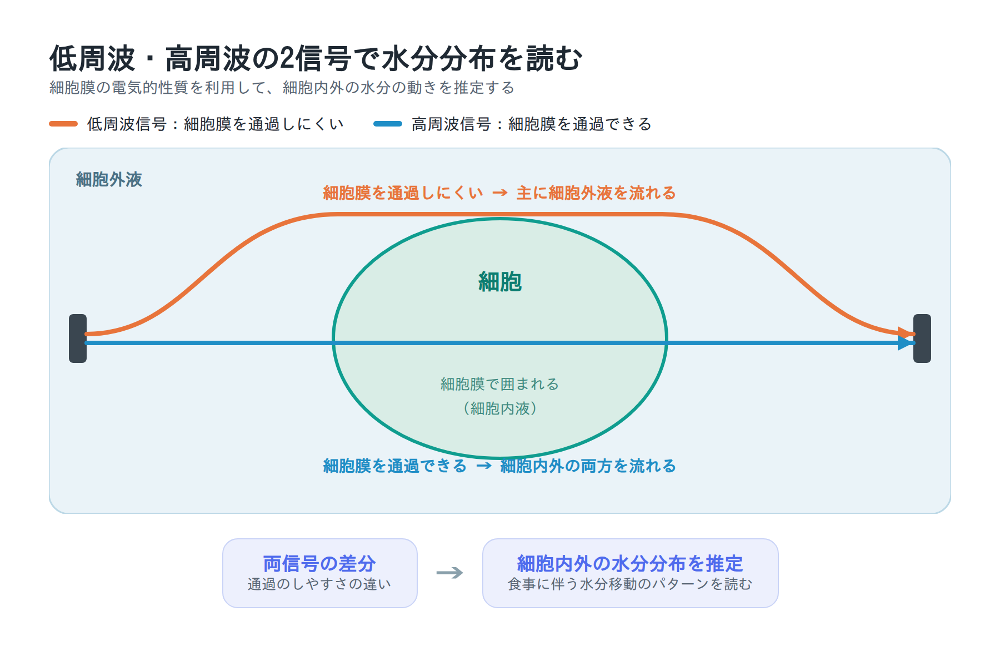
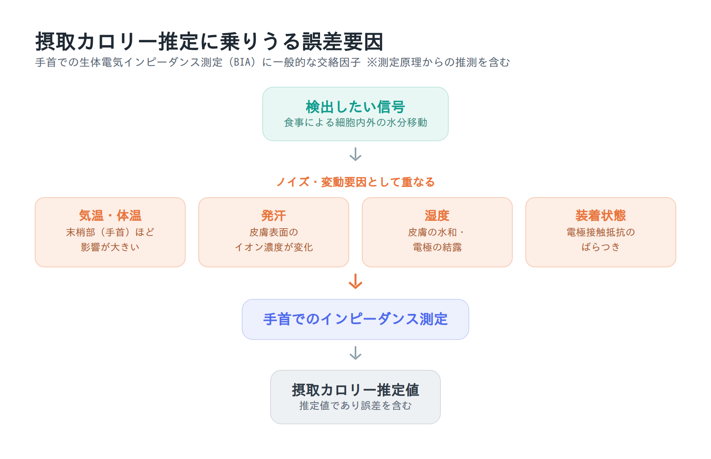

# カロリー収支を自動測定できるシャープ「からだメイト Watch」が気になったので調べてみた

> **公開先**: note.com
> **見出し画像**: `images/eyecatch.png`
> **noteへの貼り付け手順**: `note-paste.html` をブラウザで開き、全選択 → コピー → note本文に貼り付け（見出し・太字・箇条書き・リンクが変換されます）。本文中の「▼画像1〜3」の位置に `images/` の各PNGを手動アップロード。
> **ハッシュタグ案**: #ヘルスケア #スマートウォッチ #センサー #ウェアラブル

---

## はじめに

シャープが2026年7月9日に発売するスマートウォッチ「からだメイト Watch」（MH-W01）には、他のスマートウォッチにはほとんど見られない特徴があります。**食事の内容を入力しなくても、摂取カロリーを自動で測定する**というものです（本記事執筆時点の7月5日はまだ発売前です）。

一般的なスマートウォッチが扱えるのは心拍数や歩数から算出する「消費カロリー」までで、「摂取カロリー」はユーザーがアプリに食事内容を手入力するしかありませんでした。からだメイト Watchはこの摂取側を体に流す微弱電流から推定します。本記事では、公開されている情報をもとに、その測定アルゴリズムの仕組みを整理します。

## 搭載センサーは10種類、カロリー測定を担うのは3つ

「摂取カロリー測定」が話題の中心ですが、からだメイト Watch自体は多くのセンサーを積んだ多機能スマートウォッチです。シャープの公式仕様には次の10種類のセンサーが記載されています。各センサーの用途は明記されていないものも多いため、一般的なスマートウォッチの構成から推定した役割を併記します。

| センサー | 主な用途（推定を含む） |
|---|---|
| 光学式心拍センサー | 心拍数・安静時心拍・運動強度の計測。消費カロリー算出や睡眠指標に利用 |
| 血中酸素レベル用 赤色・赤外線センサー | 血中酸素レベル（SpO2）の測定。睡眠時の状態把握の目安 |
| 生体電気インピーダンスセンサー | 摂取カロリーの自動測定・体水分バランス（hydration）のモニタリング |
| 皮膚温度センサー | 皮膚温の測定（体調・睡眠指標）。インピーダンス測定の温度補正にも使える可能性 |
| 加速度センサー | 歩数・身体活動量・睡眠時の体動検知。消費カロリー算出の主軸 |
| ジャイロセンサー | 手首の動き・ジェスチャー検知（手首を返して画面点灯など）、活動計測の補助 |
| 地磁気センサー | 方位の検出。GPSと併用したルート記録・ナビの方位補正 |
| GPS | 屋外での位置・距離・ペースの記録（ランニングなど） |
| 気圧センサー | 高度・階段の上り下りの検出、天候変化の目安 |
| 照度センサー | 周囲の明るさに応じた画面輝度の自動調整 |

*※ 出典：シャープ公式製品仕様。「主な用途」は一般的なスマートウォッチ機能からの推定を含みます。*

このうち多くは、心拍・血中酸素・睡眠・歩数・GPSログといった一般的なスマートウォッチ機能のためのものです。「摂取カロリーの自動測定」というこの製品の核＝カロリー収支に直接関わるのは、次の3つに整理できます。

| センサー | カロリー収支での役割 |
|---|---|
| 生体電気インピーダンスセンサー | **摂取**カロリーの自動測定・水分バランスのモニタリング（本記事の主役） |
| 光学式心拍センサー | 心拍から**消費**カロリー（運動強度・安静時代謝）を算出 |
| 加速度センサー | 歩数・身体活動量から**消費**カロリーを算出 |

つまり摂取側は**インピーダンス**が1つで担い、消費側は**光学式心拍センサー（心拍）と加速度センサー（活動量）の2つ**が担う、という分担です。この摂取・消費を1台で取ることで、カロリー収支を手入力なしに出せる設計になっています。摂取側の主役である**生体電気インピーダンスセンサー**は、体組成計にも使われる技術で、体にわずかな電流を流し、電気抵抗（インピーダンス）の変化を読み取ります。以下ではまずこのセンサーに絞って原理を見ていきます。

## 摂取カロリー測定の原理：糖の吸収に伴う「細胞の水の動き」を読む

このセンサーは食べ物そのものを検知しているわけではありません。食事の後に体内で起こる生理的な変化を、間接的に読み取っています。流れは次の通りです。

1. 食事をすると、胃や腸で食べ物が分解され、炭水化物・タンパク質・脂質として吸収される
2. 血糖値が上がると、細胞がブドウ糖（グルコース）を取り込む
3. 細胞がグルコースを吸収する際、**細胞から水分が排出される**
4. 細胞内外の水分バランスが変わると、組織の電気抵抗が変化する
5. インピーダンスセンサーが高周波・低周波の信号を組織に流し、細胞内外の水分の動きを検出する
6. アルゴリズムがこの水分移動のパターン（グルコースカーブ）を解析し、体に取り込まれたエネルギー量＝摂取カロリーを逆算する

### なぜ高周波と低周波の2種類を使うのか：細胞膜というコンデンサ

高周波と低周波の2種類の信号を使うのは、細胞膜の電気的性質を利用するためです。

体の組織を電気的に見ると、細胞は「細胞膜という薄い絶縁体（脂質二重膜）で包まれ、電解質を含む水（細胞内液）を抱えたもの」で、そのまわりを電解質の水（細胞外液）が満たしている構造です。このとき細胞膜は、電気的に**コンデンサ（キャパシタ）のように振る舞います**。この性質のため、流す電流の周波数によって「どこを流れるか」が変わります。

- **低周波の電流**：細胞膜（コンデンサ）を通り抜けにくいため、電流は主に**細胞外液**を回り道して流れる。つまり低周波のインピーダンスは細胞外液量をよく反映する
- **高周波の電流**：細胞膜を貫通できるため、細胞内液も含めた**体水分全体**（細胞内液＋細胞外液）を流れる

この2つの差分をとることで、「細胞の外の水」と「細胞の中の水」を分けて推定できます。体組成計が体脂肪率だけでなく細胞内外の水分バランスまで出せるのも、同じ原理です。

### グルコース吸収が細胞外液を動かす

食後に血糖値が上がり、細胞がグルコースを取り込む過程で、細胞の内外では水分がやり取りされ、**細胞外液の量が変動します**。低周波インピーダンスが最も敏感に捉えるのは、まさにこの細胞外液の動きです。

FLOWアルゴリズムは、この細胞外液量の日内変動を、インピーダンスの変化として**1分あたり数回サンプリング**し、時間を追って描かれる「グルコースカーブ」から、体に取り込まれたエネルギー量を逆算します。1点の値ではなく、1日を通した水分移動の“波形”を読んでいるわけです。

重要なのは、この方式が**「食べた時」ではなく「栄養が血中に吸収された時」のカロリーを記録する**という点です。

### 測定パイプラインの全体像

食事から摂取カロリー表示までの流れを図にすると次のようになります。

*※ 図：公開情報（シャープ公式・HEALBE）をもとに筆者作成*

低周波信号と高周波信号がそれぞれ細胞内外のどこを流れるかを模式的に示すと次の通りです。

*※ 図：BIAの一般的な原理をもとに筆者作成*

## HEALBE社の特許技術「FLOWテクノロジー」

このアルゴリズムはシャープの自社開発ではなく、米HEALBE Corporationの特許技術「FLOW™テクノロジー」を活用しています。HEALBEは2012年創業のウェアラブル企業で、同じ原理の摂取カロリー自動測定バンド「GoBe」シリーズを展開してきました。

からだメイト Watchは、このFLOWテクノロジーを日本の大手家電メーカーが初めてスマートウォッチに採用した製品ということになります。

### FLOWは「水分解析」だけではなく複数センサーの統合技術

「FLOW」という名前からは水分移動の解析だけを想像しがちですが、HEALBEの実装（GoBeシリーズ）は**複数センサーのフュージョン技術**です。GoBe2では加速度センサー・ジャイロ・地磁気・ピエゾ（圧電）センサー・皮膚電気反応（GSR）センサー・インピーダンスセンサーなどを搭載し、それぞれ役割を分担しています。

- **インピーダンスセンサー**：高周波・低周波信号を組織に流し、細胞外液の水分量の変化を1分に数回読む。摂取カロリー測定の中核
- **ピエゾ（圧電）センサー**：血流・心拍のモニタリング
- **加速度センサー**：歩数・身体活動量の把握＝消費側の算出に利用。加えて性別・体重・年齢といった個人属性も計算に加味される

つまりGoBe2の段階から、摂取側はインピーダンス、消費側は心拍（ピエゾ）＋活動量（加速度）というセンサー分担が土台にありました。

### からだメイト Watchでは心拍検出が「ピエゾ→光学式」に置き換わったと考えられる

ここで注目したいのが、からだメイト Watchのセンサー構成との違いです。GoBe2で心拍・血流を担っていた**ピエゾ（圧電）センサーは、からだメイト Watchの仕様には見当たりません**。代わりに載っているのが**光学式心拍センサー（PPG）**です。

このことから、**からだメイト WatchはGoBe2のピエゾ式心拍検出を、一般的なスマートウォッチと同じ光学式心拍センサーに置き換えたのではないか**と推測できます。光学式（PPG）は現行スマートウォッチで広く使われ、ピエゾ式より安定して心拍を取りやすい方式です。腕時計型でヘルスケア機能を一通り揃えるうえでも、光学式に寄せるのは自然な選択と言えます。

この推測を踏まえると、両者のセンサー分担は次のように対応づけられます。

| 役割 | GoBe2（HEALBE） | からだメイト Watch（推測） |
|---|---|---|
| 摂取カロリー | インピーダンスセンサー | 生体電気インピーダンスセンサー |
| 心拍（消費カロリーの主要入力） | ピエゾ（圧電）センサー | **光学式心拍センサー（PPG）** |
| 活動量（消費カロリー） | 加速度センサー | 加速度センサー |

*※ 対応づけはセンサー仕様からの筆者推測です。シャープはFLOWにどのセンサーを供給しているかを公開していません。*

からだメイト Watchが10種類のセンサーのうちどれをFLOWに供給しているかは非公開ですが、少なくとも「摂取＝インピーダンス／消費＝心拍（光学式）＋活動量（加速度）」という分担は、GoBe2から引き継がれていると考えてよさそうです。

### 消化吸収には時間がかかる

栄養素が血中に現れるまでの時間は栄養素の種類によって大きく異なります。

| 栄養素・食事内容 | 吸収までの目安 |
|---|---|
| 糖分の多いもの（甘いもの） | 約1時間で90%が血中に |
| 炭水化物中心 | 2〜4時間 |
| タンパク質中心 | 6〜8時間 |
| 脂質の多いもの | 10時間程度 |

*※ 出典：ケータイ Watch・HEALBE*

そのため、からだメイト Watchで食事の摂取カロリーが確認できるのは食後数時間〜半日程度後になります。また、吸収期間は次の食事と重なることもあり、リアルタイムの食事記録というよりは「日単位のカロリー収支を把握する」ための仕組みと捉えるのが実態に近いです。

### 使用上の制約

測定原理が生理反応の観測であるため、運用にはいくつかの条件があります。

- **長時間の装着が必要**：食事中・睡眠中を含め1日22〜23時間の装着が推奨される。少なくとも食事の30分前には着用しておく必要がある
- **キャリブレーション期間がある**：初回装着から正確な測定に至るまで個人差があり、2〜3日から10日〜2週間程度かかる。完了通知はなく、徐々にデータが安定していく
- **栄養素の内訳はわからない**：ウォッチ単体で測定できるのはカロリー総量のみ。栄養素の推定には食事写真を送る有料オプション（からだメイト Plusプラン、月600円）が必要
- **特定の食事法では精度が落ちる**：HEALBEによれば、ファスティングや高タンパク・高脂質の食事では精度が低下する

## 精度はどの程度か

シャープによれば、カリフォルニア大学と広州赤十字病院の検証研究で評価されたアルゴリズムが用いられており、研究条件下でのカロリー推定精度は**約89%**とされています。

元になっているのはHEALBE GoBe2に対するカリフォルニア大学デービス校（UC Davis）Foods for Health Instituteの検証研究（2018年）です。概要は次の通りです。

- **対象**：18〜40歳の成人ボランティア27名（男性11名・女性16名）、14日間
- **方法**：UC Davisの調理施設で管理栄養チームが全食事を計量・提供し、食べ残しも記録。この実測摂取カロリーとデバイスの推定値の相関を評価
- **結果**：3日間移動平均で精度87%、14日間全体では**89.6%**

なお、シャープが引き合いに出す検証はもう一つあります。広州赤十字病院での研究（被験者13名・28日間）です。ただしこちらは摂取カロリー推定の乖離が平均で**約16%**（相対差 約12%）と報告されており、UC Davisの89.6%より精度は低めに出ています。被験者数・食事管理の条件が異なるため単純比較はできませんが、「条件が変われば精度も動く」ことを示す例と言えます。よく引用される「約89%」は、あくまで管理された研究条件での上振れ側の数字として捉えておくのが無難です。

ただし注意点もあります。この研究は27名・14日間という小規模なもので、被験者は代謝異常につながる疾患・行動をスクリーニングで除外されています。また、HEALBE製品はレビューでは精度への評価が分かれてきた経緯があり、シャープ自身も「摂取カロリーは推定値であり、体質や使用状況などにより実際の摂取量とは異なる場合がある」と明記しています。1kcal単位の正確さを求めるものではなく、食べ過ぎの傾向や日々の変化を捉える用途と考えるのが妥当です。

## 誤差になりうる要因を考える

からだメイト Watch自体の詳細な誤差要因は公開されていませんが、測定原理が**手首での生体電気インピーダンス測定**である以上、体組成計などのBIA（Bioelectrical Impedance Analysis）機器で知られている誤差要因が同様に影響すると推測できます。以下は測定原理からの推測を含みますが、根拠となる文献を併記します。

なお、BIA機器の誤差要因は医学・工学分野で体系的に整理されており、皮膚界面でのインピーダンス測定には**40種類もの交絡因子**が存在すると報告されています。ここでは特に日常利用で影響が大きそうなものを取り上げます。

### 気温・体温の影響

気温は誤差要因として特に影響が大きいと考えられます。温度が上がるとイオンの移動度が高まって電気抵抗が下がるという熱力学的な効果があり、また周囲の気温変化は皮膚血流を変え、皮膚温度・皮膚インピーダンスを変化させます。

重要なのは、**手首のような胴体から遠い末梢部ほど温度の影響を受けやすい**という点です。ある研究では周囲温度を13〜39℃で変化させたとき、前腕のインピーダンスは約14%、全身では約8%変化したのに対し、胴体に近い膝間の測定では約2%の変化にとどまりました。からだメイト Watchは手首という末梢部で測定するため、冬場の屋外と暖房の効いた室内を行き来するような場面では、温度由来の変動が相対的に大きく出る可能性があります。

### 発汗の影響

発汗は皮膚表面のイオン濃度を局所的に変化させ、皮膚インピーダンスに直接影響します。汗には電解質（ナトリウムなど）が含まれるため、運動時や高温環境で大量に発汗すると、皮膚-電極間の導電状態が「食事による細胞内外の水分移動」とは無関係に変動しかねません。

からだメイト Watchが検出しようとしているのは食事に伴うわずかな水分移動のパターンです。発汗による皮膚表面の水分・電解質変化は、この微細な信号に対するノイズとして重なる可能性があります。運動直後の測定値は割り引いて見たほうがよいと推測できます。

### 湿度の影響

周囲の湿度も皮膚の水和状態を通じてインピーダンスに影響します。

- **乾燥した環境**：皮膚表面の水分が奪われ、皮膚インピーダンスが上昇する
- **多湿な環境**：逆方向に作用し、過度な湿度では電極表面に結露が生じて異常値（spurious readings）を招くことがある

湿度は前述の「体内の水分バランス（hydration）」とも相互に関係するため、単独で切り分けるのが難しい交絡因子とされています。

### 装着状態（電極接触）の影響

BIA測定では、電極と皮膚の接触抵抗のばらつきが測定誤差の大きな原因になることが知られています。腕時計型は装着の緩さ・きつさ、手首の位置、汗や皮脂による接触状態の変化などが日によって異なりやすく、これも変動要因になり得ます。メーカーが長時間（1日22〜23時間）の連続装着を推奨する背景には、装着状態を一定に保ち、日々のベースラインを安定させる狙いがあると考えられます。

### 誤差要因の整理

*※ 図：BIAの一般的な誤差要因をもとに筆者作成（からだメイト Watch固有の値ではありません）*

これらはあくまで**BIAの一般的な特性からの推測**であり、からだメイト Watchが内部でどのような補正（温度センサーによる補償、長期キャリブレーション、移動平均処理など）を行っているかは非公開です。前述のUC Davis検証も温度・湿度が管理された環境で実施されたもので、日常の変動環境での精度がそのまま89%になるとは限らない点には留意が必要です。

## 消費カロリーとの収支の可視化

消費カロリー側は、**光学式心拍センサーによる心拍数**と**加速度センサーによる歩数・身体活動量**を組み合わせて算出する、一般的なスマートウォッチと同様の方式です。前述のとおり、これはGoBe2がピエゾ（心拍）＋加速度（活動量）で行っていた消費側の推定を、心拍検出だけ光学式に置き換えた形と考えられます。摂取（インピーダンス）・消費（光学式心拍＋加速度）の両方をデバイス単体で取得できることで、日々のカロリー収支（摂取−消費）を手入力なしで可視化できるのが本機の核となる体験です。

測定データは刷新されたヘルスケアアプリ「からだメイト」に集約され、「食事」「睡眠」「運動」「体調」の4分類でスコア化されます。アプリ側にはシャープ独自のAI画像処理技術による食事写真認識（約15万件の料理データと照合）も搭載されており、栄養素レベルの分析はこちらが担う設計です。

## まとめ

- からだメイト Watchの摂取カロリー自動測定は、**「グルコース吸収に伴う細胞内外の水分移動」を生体電気インピーダンスで検出し、カロリーに逆算する**仕組み
- コアアルゴリズムは米HEALBE社の特許技術「FLOWテクノロジー」で、摂取（インピーダンス）・消費（心拍＋活動量）を複数センサーで統合する仕組み。GoBe2では心拍をピエゾで取っていたが、**からだメイト Watchでは光学式心拍センサーに置き換わったと推測される（消費カロリー＝光学式心拍＋加速度）**。UC Davisの検証では精度約89%だが、広州赤十字病院の検証では乖離約16%と、条件によって精度は幅がある
- 測定は「食べた時」ではなく「吸収された時」に行われ、反映まで数時間〜半日かかる。1日22〜23時間の装着が推奨されるなど運用上の制約もある
- 手首でのBIA測定という性質上、**気温・発汗・湿度・装着状態**などが誤差要因になりうる。特に末梢部は温度の影響を受けやすく、日常の変動環境では検証値ほどの精度が出ない可能性がある（推測を含む）
- カメラや手入力に頼らない摂取カロリー推定というアプローチは珍しく、食事記録の継続が苦手な人にとって新しい選択肢になりうる

## おわりに

本記事を書いている7月5日時点では、からだメイト Watchはまだ発売前（発売は7月9日）です。ここまでの内容は、公開情報とBIAの一般的な特性からの整理・推測にとどまります。

私自身、食事管理を日常的な課題としているダイエッター（メタボ）であり、同時にこうしたセンシング技術を追いかけるエンジニアでもあります。「入力なしで摂取カロリーがわかる」というコンセプトには両方の立場から強く惹かれていて、**すでに予約済み**です。

製品が手元に届いたら、実際の使用感を確かめつつ、本記事で挙げた誤差要因（気温・発汗・湿度・装着状態など）が測定値にどう影響するのか、ちょっとした実験をしてみるつもりです。たとえば次のような検証を考えています。

- 同じ食事を摂ったときの推定カロリーが日によってどれくらいブレるか
- 運動直後（発汗時）と安静時で測定値に差が出るか
- 装着のきつさや装着位置を変えたときの変化

その結果はあらためて別の記事としてまとめる予定です。実測データが出たら、この推測がどこまで当たっていたのかも含めて報告したいと思います。

## 参照元

1. [どう実現？「食べるだけでカロリー自動測定」を叶えるシャープのスマートウォッチ独自の仕組みとは - ケータイ Watch](https://k-tai.watch.impress.co.jp/docs/news/2117534.html)
2. [スマートウォッチ「からだメイト Watch」を発売｜ニュースリリース：シャープ](https://corporate.jp.sharp/news/260616-c.html)
3. [FLOW™ Technology - HEALBE公式サイト](https://healbe.com/info_technology/)
4. [Validation HEALBE GoBe2 | UC Davis and Guangzhou Red Cross Hospital - HEALBE](https://healbe.com/validation/)
5. [Preliminary Study Finds Healbe GoBe2 Offers Accuracy in Measuring Calorie Intake - GlobeNewswire](https://www.globenewswire.com/news-release/2019/01/18/1701979/0/en/Preliminary-Study-Finds-Healbe-GoBe2-Offers-Accuracy-in-Measuring-Calorie-Intake.html)
6. [UC Davis taps Healbe to validate caloric intake-tracking wearable band - MobiHealthNews](https://www.mobihealthnews.com/news/uc-davis-taps-healbe-validate-caloric-intake-tracking-wearable-band)
7. [ヘルスケアアプリ「からだメイト」を刷新｜ニュースリリース：シャープ](https://corporate.jp.sharp/news/260616-a.html)
8. [Confounding Factors and Their Mitigation in Measurements of Bioelectrical Impedance at the Skin Interface - Bioengineering (MDPI)](https://doi.org/10.3390/bioengineering12090926)
9. [Influence of ambient temperature on whole body and segmental bioimpedance spectroscopy - Journal of Physics: Conference Series](https://iopscience.iop.org/article/10.1088/1742-6596/224/1/012128/pdf)
10. [Effect of electrode contact impedance mismatch on 4-electrode measurements of small body segments using commercial BIA devices - IMEKO](https://www.imeko.org/publications/tc4-2014/IMEKO-TC4-2014-426.pdf)
11. [Healbe GoBe: How it works（HEALBE公式マニュアル）](https://healbe.com/manual/)
12. [Review Healbe GoBe 2: can this wearable really count calories consumed? - Gadgets & Wearables（搭載センサーの一覧）](https://gadgetsandwearables.com/2018/05/13/review-healbe-gobe-2/)
